# SFND Unscented Kalman Filter (UKF) for 2D Object Tracking
  
## Procject Scope and Objective


  
*Fig. 1: Animation the simuated highway environment and the UKF object tracking process (Source: Udacity)*

The objective of this Sensor Fusion Unscented Kalman Filter (UKF) Highway Project is to implement a UKF to estimate the state [x-position, y-position, longitudinal velocity, yaw angle, yaw rate] of multiple other (target) cars on a highway in a simulation envinroment using noisy Lidar and Radar measurements. The states and sensor measurements are measured relative to the moving coordinate system of the ego car. For each target object to be tracked a new UKF instance is initiated. The goal is to adjust the UKF such that we obtain root mean square error (RMSE) values for the state estimates of each target vehicle w.r.t. the ground truth states that are lower than some given tolerance thresholds over all target objects, which are:
  
RMSE([x-position, y-position, longitudinal velocity, yaw angle, yaw rate]) <= [0.30, 0.16, 0.95, 0.70]
  
The main program can be built and ran by following below steps:

1. mkdir build
2. cd build
3. cmake ..
4. make
5. ./ukf_highway

The UKF is implemented in src/ukf.cpp and src/ukf.h. The main program main.cpp initializes a simple highway simulation enviornment and loops over a predefined number of steps simulating one scene after another.

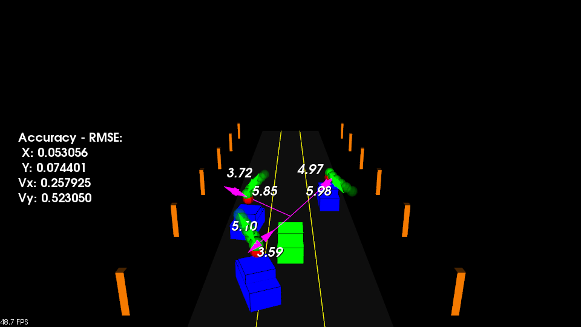
  
*Fig. 2: Screen shot of the simuated highway environment and the UKF object tracking process with cumulated RMSE values*

`main.cpp` use `highway.h` to create a simple highway environment with three straight lanes rimmed by poles on both sides. Besides the ego car, which goes straight with constant velocity on the center lane, there is another target car on each lane. The viewer scene is centered around the ego car and the coordinate system is relative to the ego car as well. The ego car is green while the other traffic cars are blue. The traffic cars will be accelerating and altering their steering to change lanes. Each of the traffic car's has it's own UKF object generated for it, which is updated individually during every time step.  

The red spheres above the target cars represent the (x,y) Lidar detections and the purple lines show the Radar measurements with the velocity magnitude in radial direction along the detected bearing angle. The green sheres represent the predicted path (e.g. the next 5 steps) of each target car using the UKF model. The Z axis is not taken into account for tracking, so we only have a 2D tracking along the X/Y axis.

---

## Important Dependencies

* cmake >= 3.5
  * All OSes: [click here for installation instructions](https://cmake.org/install/)
* make >= 4.1 (Linux, Mac), 3.81 (Windows)
  * Linux: make is installed by default on most Linux distros
  * Mac: [install Xcode command line tools to get make](https://developer.apple.com/xcode/features/)
  * Windows: [Click here for installation instructions](http://gnuwin32.sourceforge.net/packages/make.htm)
* gcc/g++ >= 5.4
  * Linux: gcc / g++ is installed by default on most Linux distros
  * Mac: same deal as make - [install Xcode command line tools](https://developer.apple.com/xcode/features/)
  * Windows: recommend using [MinGW](http://www.mingw.org/)
  * Code styleguide [Google's C++ style guide](https://google.github.io/styleguide/cppguide.html)
 * PCL 1.2
 * gnuplot 5.2 [gnuplot])http://www.gnuplot.info/)
  * gnuplot is a command line plotting tool that is used here to plot the estimated states and state estimation errors over time  
  
## Basic Build Instructions

1. Clone this repo.
2. Make a build directory: `mkdir build && cd build`
3. Compile: `cmake .. && make`
4. Run it: `./ukf_highway`

## Generating Additional Data

The simualtion environment, and thus, the generation of Lidar and Radar data can be altered by modifying the code in `highway.h`, e.g. changing the actuation profile of the target cars to be tracked. The code in `tools.cpp` defines how Lidar or Radar measurements are taken. For instance, Lidar markers can be the (x,y) center of bounding boxes by scanning the PCD environment and performing clustering. This is similar to what was done in [Sensor Fusion Lidar Obstacle Detection](https://github.com/AndiA76/SFND_Lidar_Obstacle_Detection).

## Logging and Visualizing the UKF Object Tracking Results

The results of the UKF object tracking process for each target car including the estimated states, the ground truth states, the state estimation errors and the Nonlinear Innvoation Squared (NIS) values for both Lidar and Radar measurements are recorded in a log file `ukf_output\data_log.csv` and visulized using gnuplot. The data logging and data visualization methods are implemented in the Highway() class in `highway.h`.

---

# Working Principle of the Unscented Kalman Filter (UKF)

## Architecture

Fig. 3 shows the architecture of the UKF for tracking objects in a simulated highway environment as shown in fig. 1 using either Lidar or Radar measurements alternatingly upon availability.
  

  
*Fig. 3: Architecture of the UKF Object Tracking system implemented in this project (Source: Udacity)*

## Prediction and Measurement Update Process of the Unscented Kalman Filter

The prediction and measurement update process of the UKF follows the steps given below (s. fig. 4), where the measurement update can either happen using a Lidar or a Radar measurement depending on availability in the current time step:

```
* Prediction: 1. Generate Sigma Points
              2. Predict Sigma Points
              3. Predict Mean & Covariance

* Update:     1. Predict Measurement
              2. Update State
```


  
*Fig. 4: Prediction and measurement update process of the UKF (Source: Udacity)*
  
## Motion Models and Kalman Filters

A Kalman Filter - also a UKF - uses a process or plant model to predict the next states and measurement model to predict the next measurements. After the prediction step the states are updated using a real measurement taken from some sensor(s). In our case, we use a simplified 2D motion model of a car on even ground as a process or plant model. There are different basic motion models to be used to build Kalman Filters for 2D object tracking. The most typical ones sorted by increasing complexity are the following:

* constant velocity model (CV)
* constant turn rate and velocity magnitude model (CTRV)
* constant turn rate and acceleration (CTRA)
* constant steering angle and velocity (CSAV)
* constant curvature and acceleration (CCA)

Each 2D motion model makes different assumptions about a target object's (e.g. a target car's) motion on driving ground. All of them assume a flat horizontal driving ground where the car's movements are restricted to 2D dimensions (x, y). The most basic motion model (CV) only assumes a constant velocity oriented in some x-y-direction.

For this project, a constant turn rate and velocity magnitude model (CTRV) is used. It assumes both a constant velocity oriented in some x-y-direction and a constant turn rate about the yaw axis (z-axis), or constant yaw rate, respectively. The state equations for the CTRV model including additional process noise (s. below) are as follows:

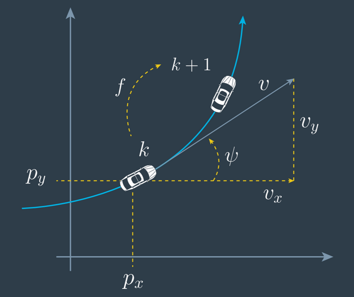

*Fig. 5: State transitions in Constant Turn Rate and Velocity Magnitude (CTRV) motion model (Source: Udacity)*

### <strong>CTRV Motion Model Equations</strong>

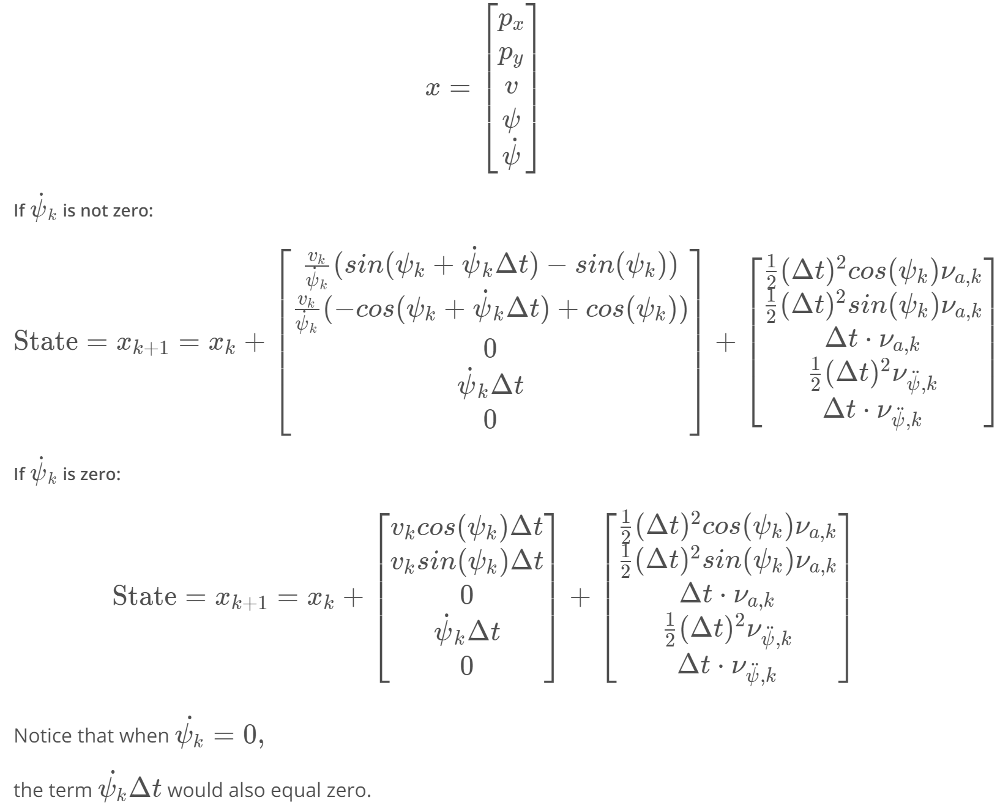

*Fig. 6: State equations for the Constant Turn Rate and Velocity Magnitude (CTRV) motion model including process noise (Source: Udacity)*

---

## Prediction

### Generating Sigma Points

In order to deal with non-linear distributions the UKF uses the unscented transformation based on sigma points. The UKF approximates the distribution of the predicted states by spawning sigma points around a predicted mean value using a spreading factor. This way, it is possible to cope with non-gaussian-like distributions, too. The number of sigma points equals ``` 2*nx + 1```, where ```nx``` is the dimension of the state vector. The first sigma point is the mean of the previous iteration, and for each state there is another pair of sigma points.

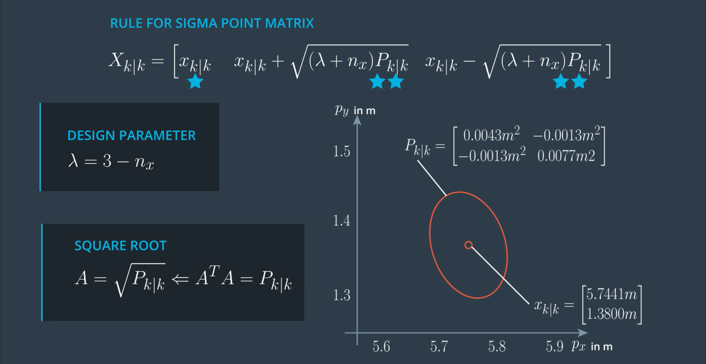
  
*Fig. 7: Sigma point generation (Source: Udacity)*

Here, P<sub>k|k</sub> = the state covariance matrix from previous iteration <br />
x<sub>k|k</sub> = mean from previous state<br />
X<sub>k|k</sub> = vector holding the sigma points<br />
k = index of the kth state vector compont<br />
&lambda;  = sigma point spreading parameter (best practice: &lambda; = 3 - nx) <br />
  
### State Augmentation

State augmentation with additional process noise allows to incorporate disturbances into a non-linear motion model in an easy-to-control manner. Process noise is included in the process model by adding state variables for the process generating the noise. In case of the CTRV model, two parameters define the process noise:

* &sigma;<sub>a</sub><sup>2</sup> representing longitudinal acceleration noise
* &sigma;<sub><mover accent="true">{<mrow><mi>&psi;</mi></mrow><mo>..</mo>}</mover></sub><sup>2</sup> representing yaw acceleration noise (or angular acceleration noise)

The stochastic variations of linear acceleration and angualar acceleration are incorporated into the process model as two additional states.
  
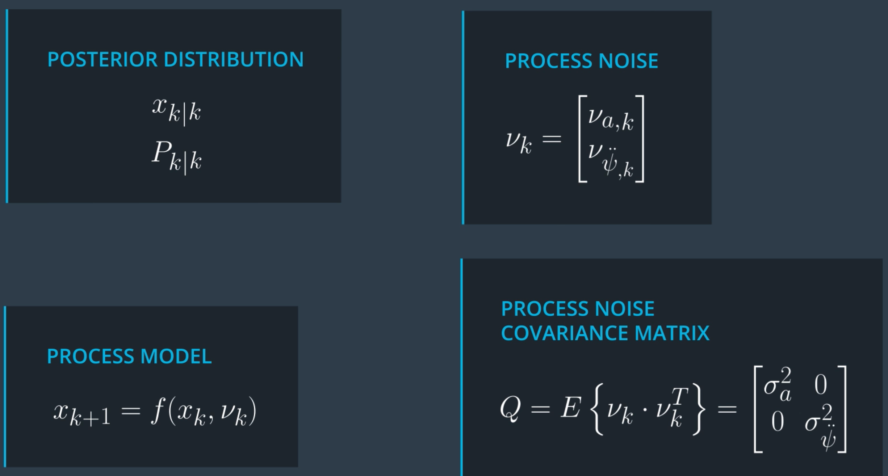

*Fig. 8: State augmentation with additional process noise on linear acceleration and angular acceleration (Source: Udacity)*

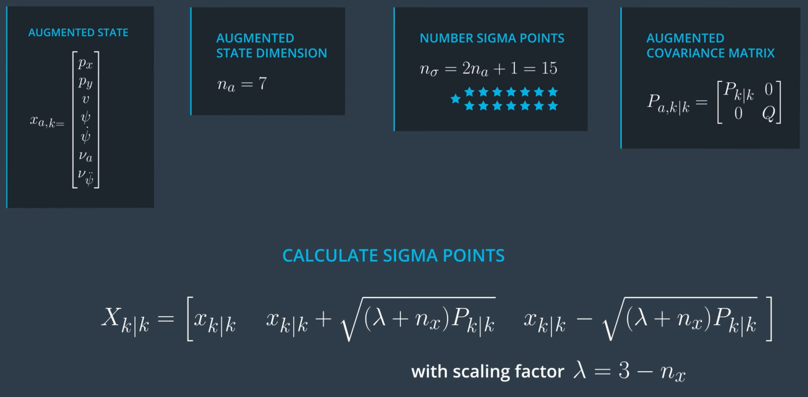
  
*Fig. 9: Calculation of sigma points for the noise augmented state vector (Source: Udacity)*
  
### Predict Sigma Points

In order to predict the sigma points for the original 5x1 state vector, the generated sigma points for the augmented 7x1 state vector are inserted one by one into the process model. We obtain a matrix of predicted sigma points for the original state vector as shown in fig. 10.

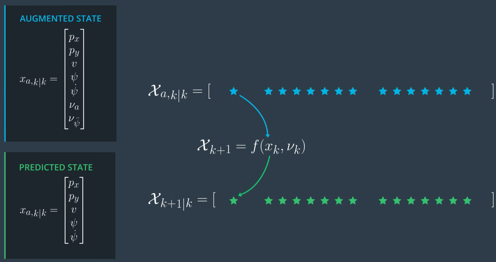
  
*Fig. 10: Predict sigma points (Source: Udacity)*
  
### Predict State Mean and State Covariance

Based on the predicted sigma points, we can now calculate the mean and covariance of the predicted state as shown in fig. 11 considering a weight for each sigma point. The weights (s. fig. 12) include the spreading parameter &lambda; to determine how far the sigma points stray around the mean.

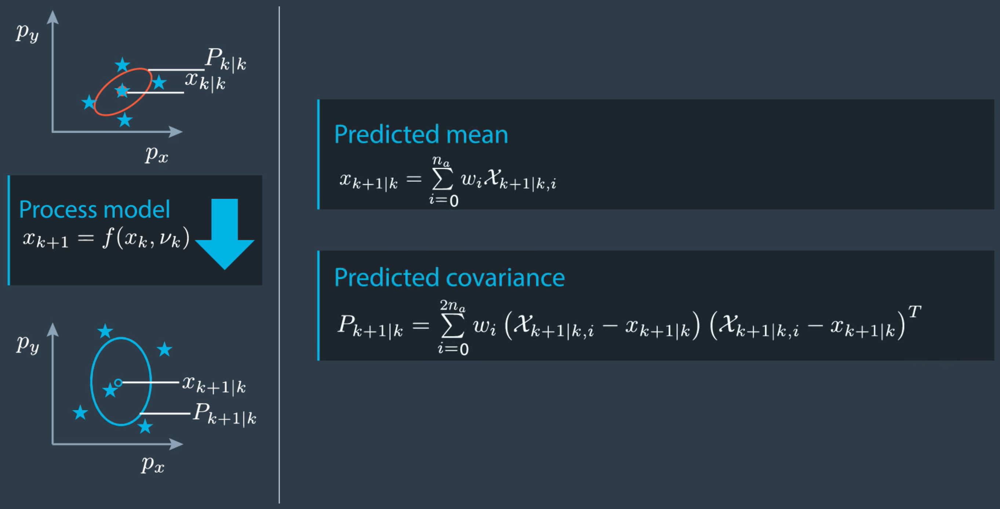

*Fig. 11: Predict state mean and state covariance matrix from sigma points (Source: Udacity)*

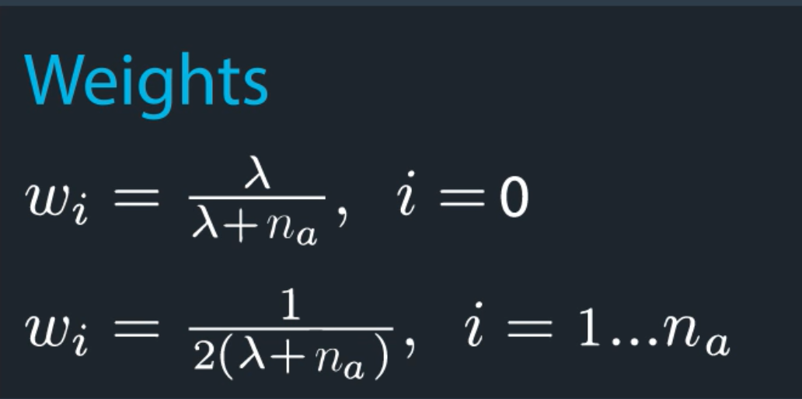

*Fig. 12: Weighting factors for the sigma points (Source: Udacity)*
  
---

## Update

### Predict Measurement

Now the data from prediction space needs to be transformed to measurement space using the measurement models of the current sensor. This measurement model varies from sensor to sensor. Using the predicted measurement and the latest measurement, we can calcuate the measurement covariance matrix as shown in fig. 14. Here we add some measurement noise depending on the sensor from which the measurement comes.
  
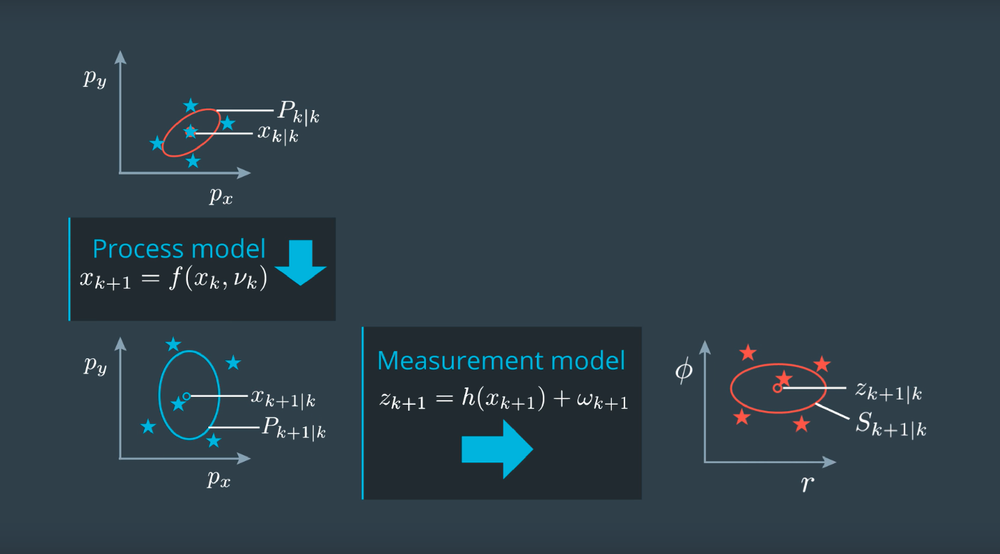

*Fig. 13: From state sigma points to measurement sigma points (Source: Udacity)*

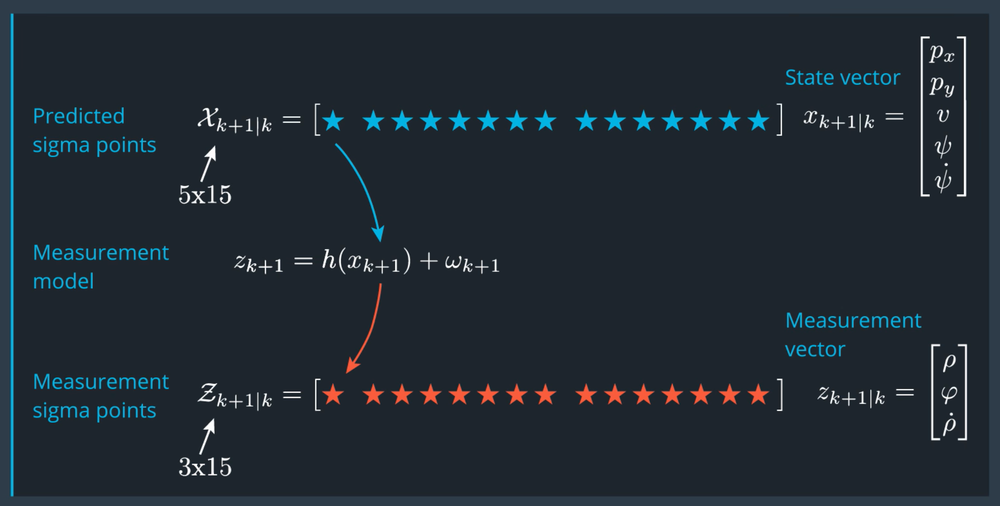

*Fig. 14: Predict measurement sigma points (Source: Udacity)*

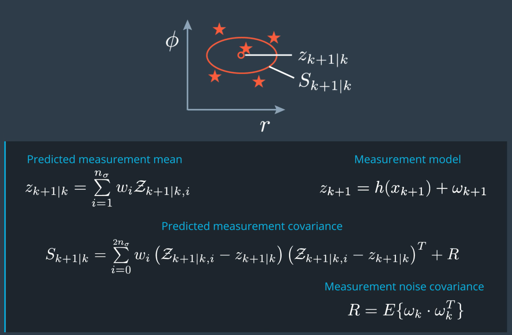
  
*Fig. 15: Predict measurement mean and measurement covariance from measurement sigma points (Source: Udacity)*

#### Radar Measurement Model

A Radar sensor measures the range and bearing angle to a target location. A Doppler Radar can also directly measure the velocity component in bearing direction by measuring the doppler frequency shift between the outgoing and the incoming Radar signals. Hence, the Radar measurement model uses polar coordinates as is shown in fig. 15.

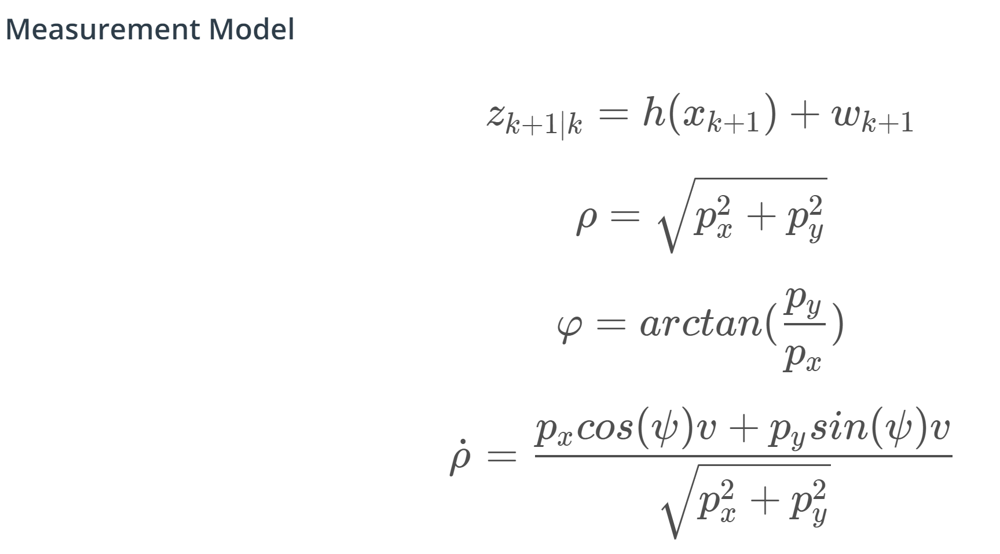
  
*Fig. 16: Radar measurement model (Source: Udacity)*

#### LiDAR Measurement Model

In case of Lidar there are only two states, namely, the (x/y) coordinates of the target object relative to the ego vehicle:

x = P<sub>x</sub> <br />
y = P<sub>y</sub>

### Update State

With the predicted state, the latest sensor measurement, the predicted measurement and the predicted measurement covariance matrix, we can calculate the Kalman Filter Gain matrix, next the state update, then the state covariance matrix and finally the cross-correlation matrix between state and measurement as is shown in figure 17.
  
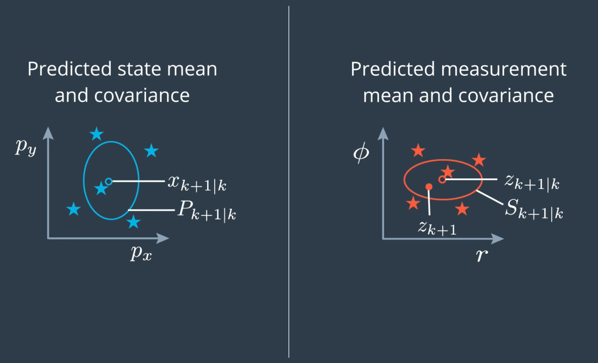

*Fig. 17: Predicted state mean and state covariance | Predicted measurement mean and measurement covariance (Source: Udacity)*

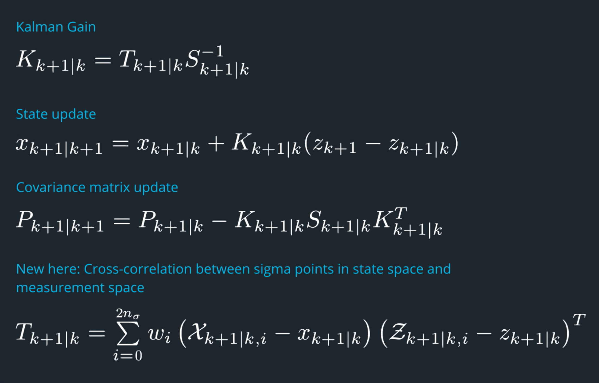

*Fig. 18: Measurement update including the Kalman Filter Gain, the state vector, the state covariance matrix and the cross-correlation matrix (Source: Udacity)*

---

## Reference

[1]: [Udacity's Sensor Fusion Nano Degree](https://www.udacity.com/course/sensor-fusion-engineer-nanodegree--nd313)

[2]: [The unscented kalman filter - anything ekf can do I can do it better!](https://towardsdatascience.com/the-unscented-kalman-filter-anything-ekf-can-do-i-can-do-it-better-ce7c773cf88d)

[3]: [The Unscented Kalman Filter for Nonlinear Estimation](https://www.seas.harvard.edu/courses/cs281/papers/unscented.pdf)

[4]: [Unscented KalmanFilter Tutorial](https://cse.sc.edu/~terejanu/files/tutorialUKF.pdf)

[5]: [The Unscented Kalman Filter, simply the best! Python code](https://jgoslinski.medium.com/the-unscented-kalman-filter-simply-the-best-python-code-5cd5ebaebf5f)

# Evaluation

## Performance of UKF tracking using Lidar and Radar Measurements

Fig. 2 shows a screenshot of the UKF tracking process using both Lidar and Radar measurements and the noise standard deviation settings in table 1. Table 2 shows the RMSE values for the position and velocity components in x- and y-direction. It also shows the results when performing the tracking process with the same noise settings using only Lidar or only Radar measurements. However, the RMSE criteria fails using only one sensor with the same noise settings.
The tracking process using sensor fusion of both Lidar and Radar clearly yields the better results than only using Lidar or Radar alone, what is an expected outcome as there are more measurements available. It does not matter much that they have a different accuracy as the prediction accuracy increases with each measurement update in the Kalman Filter - even if it is of lower accuracy. When using both Lidar and Radar together, it is also possible to use higher acceleration noise settings, which least to a higher bandwidth and a quicker and better tracking with less deviations, in comparison with UKF tracking using only one sensor.
  
|Process noise standard deviation|Lidar and Radar|Lidar only|Radar only|
|:-:|:-:|:-:|:-:|
|std_a_|2.0|2.0|2.0|
|std_yawdd|2.0|2.0|2.0|
  
*Table 1: Process noise settings for UKF using Lidar and Radar, Lidar only and Radar only*
  
|State|Lidar and Radar|Lidar only|Radar only|RMSE threshold|
|:-:|:-:|:-:|:-:|:-:|
|px|0.0570911|0.1243|0.168135|0.3|
|py|0.0633613|0.0655423|0.542865|0.16|
|vx|0.380639|0.914108|0.47127|0.95|
|vy|0.392035|0.406055|1.09965|0.7|
  
*Table 2: Accuracy (RMSE) of UKF using Lidar and Radar, Lidar only and Radar only*
  
### Visualization of the estimated States and State Estimation Errors w.r.t. to Ground Truth

The following plots show the estimated (predicted) states and the state estimation errors against ground truth for each state of all three target cars in the highway simulation for UKF tracking using both Lidar and Radar measurements and the acceleration noise settings from table 1.
  
#### Target car 1
  
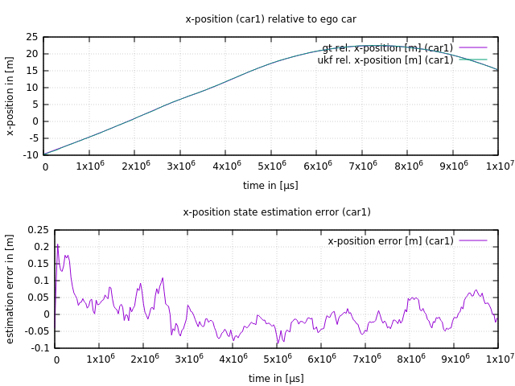

*Fig. 19: X-position and x-position estimation error over time of target car 1*

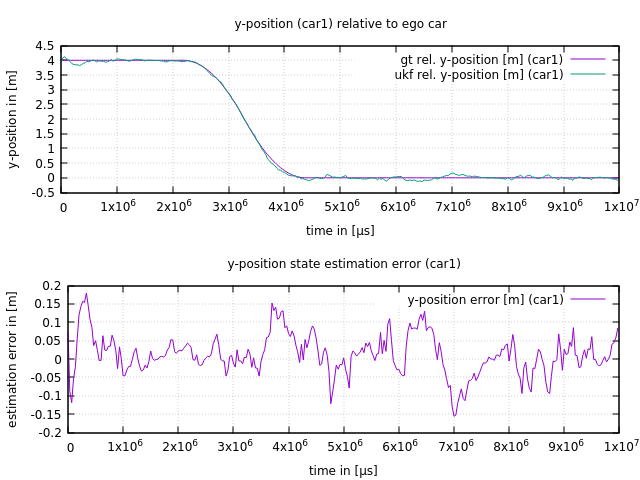

*Fig. 20: Y-position and y-position estimation error over time of target car 1*

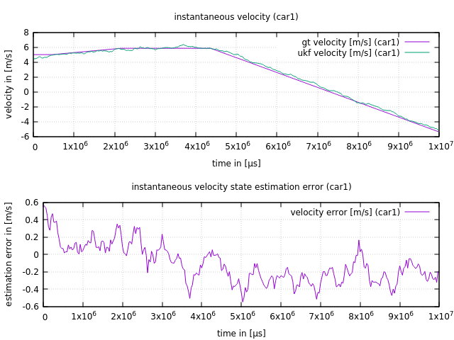

*Fig. 21: Velocity and velocity estimation error over time of target car 1*

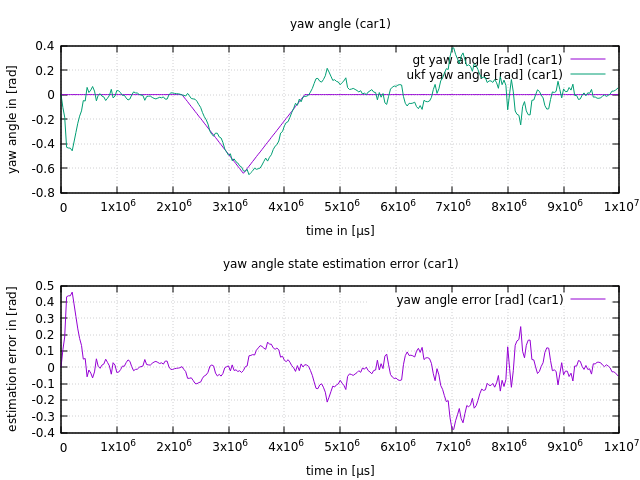

*Fig. 22: Yaw angle and yaw angle estimation error over time of target car 1*

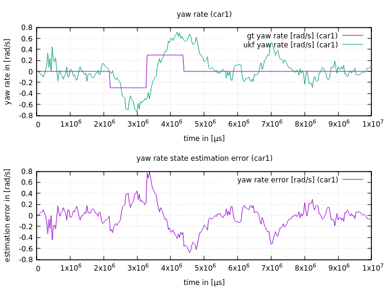

*Fig. 23: Yaw rate and yaw rate estimation error over time of target car 1*

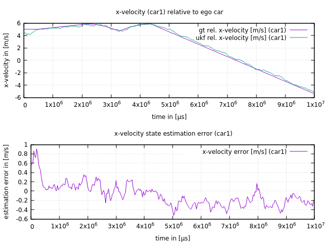

*Fig. 24: X-velocity and x-velocity estimation error over time of target car 1*

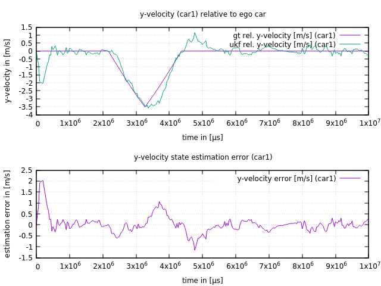

*Fig. 25: Y-velocity and y-velocity estimation error over time of target car 1*

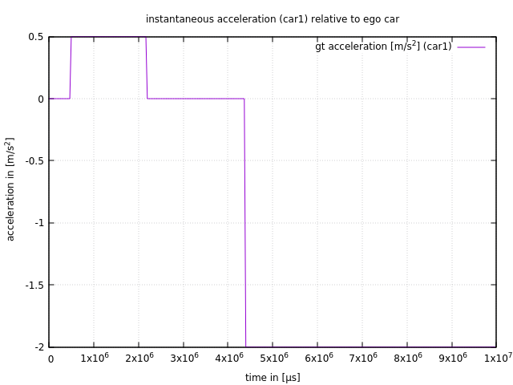

*Fig. 26: Acceleration (ground truth) over time of target car 1*

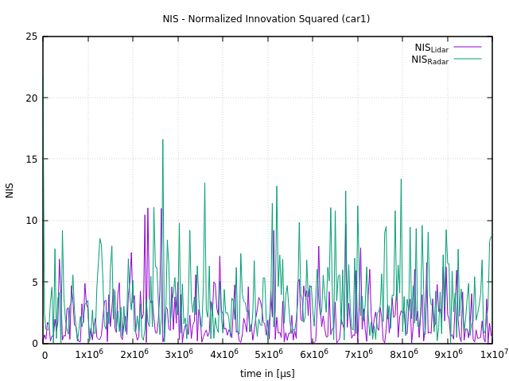

*Fig. 27: NIS (Normalized Innovation Squared) for Lidar and Radar measurement over time for target car 1*
   
#### Target car 2
  
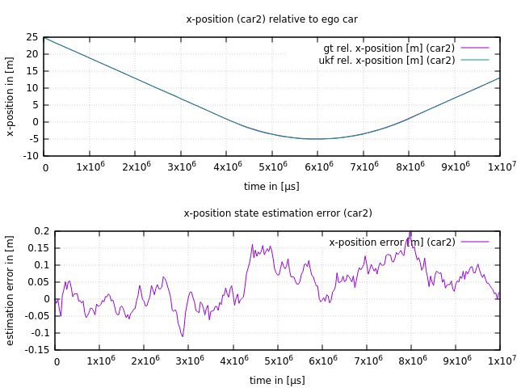

*Fig. 28: X-position and x-position estimation error over time of target car 2*

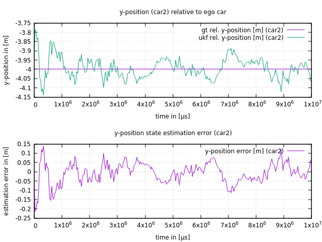

*Fig. 29: Y-position and y-position estimation error over time of target car 2*

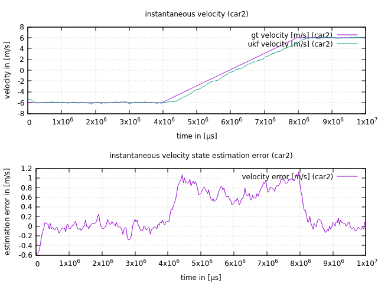

*Fig. 30: Velocity and velocity estimation error over time of target car 2*

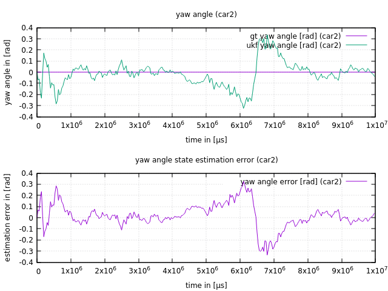

*Fig.31: Yaw angle and yaw angle estimation error over time of target car 2*

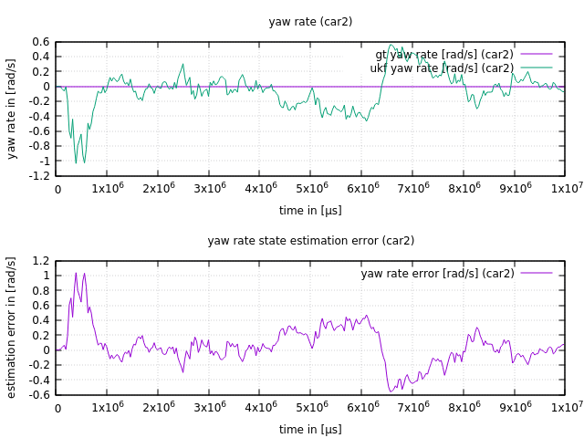

*Fig. 32: Yaw rate and yaw rate estimation error over time of target car 2*

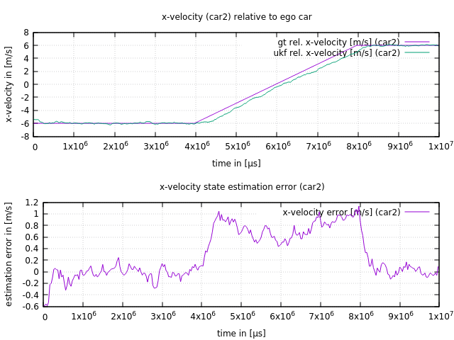

*Fig. 33: X-velocity and x-velocity estimation error over time of target car 2*

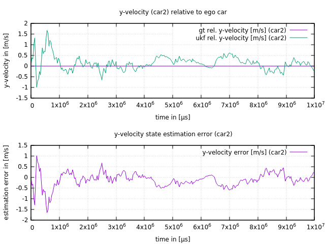

*Fig. 34: Y-velocity and y-velocity estimation error over time of target car 2*

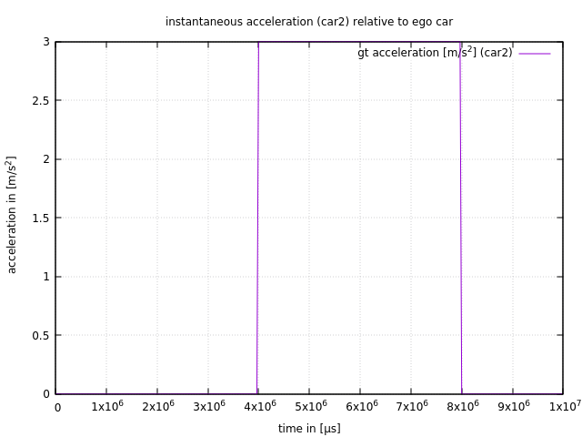

*Fig. 35: Acceleration (ground truth) over time of target car 2*

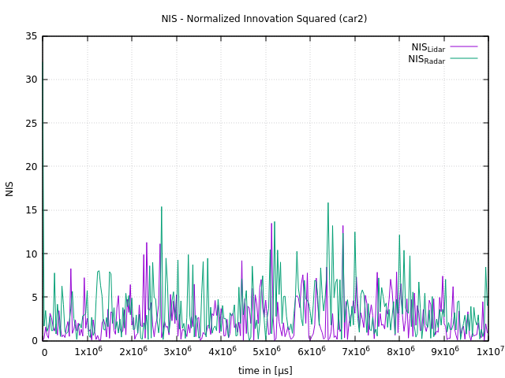

*Fig. 36: NIS (Normalized Innovation Squared) for Lidar and Radar measurement over time for target car 2*
  
#### Target car 3
  
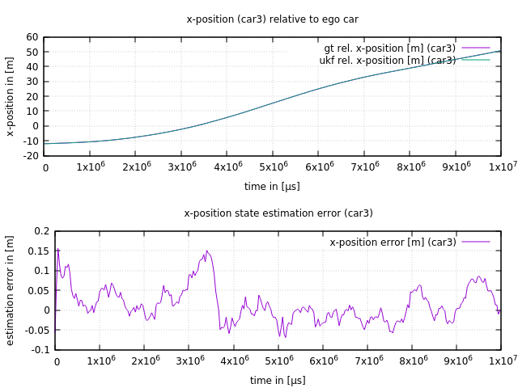

*Fig. 37: X-position and x-position estimation error over time of target car 3*

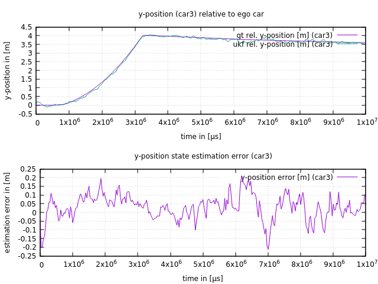

*Fig. 38: Y-position and y-position estimation error over time of target car 3*

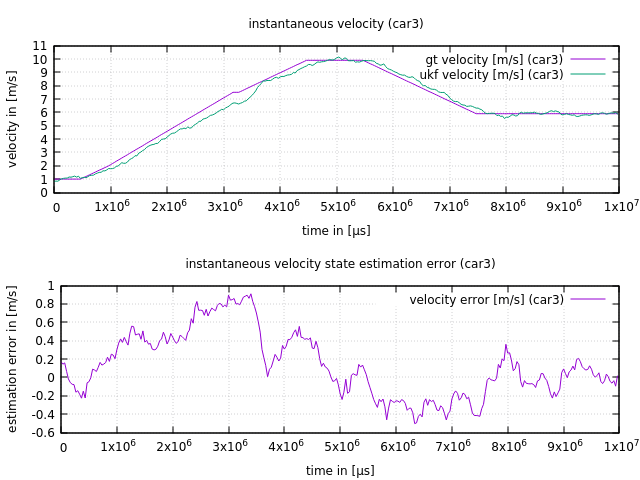

*Fig. 39: Velocity and velocity estimation error over time of target car 3*

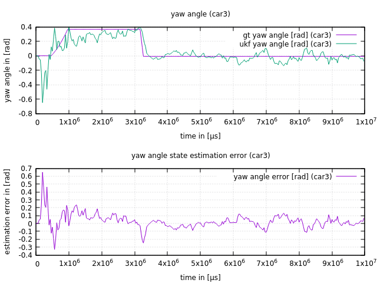

*Fig. 40: Yaw angle and yaw angle estimation error over time of target car 3*

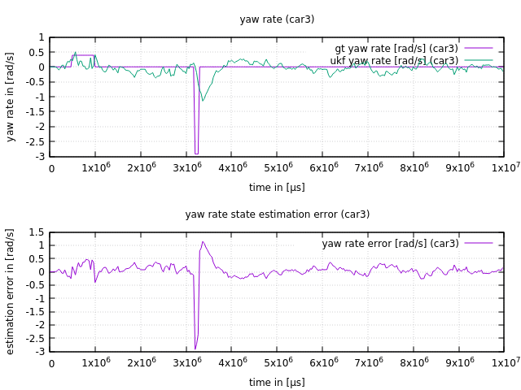

*Fig. 41: Yaw rate and yaw rate estimation error over time of target car 3*

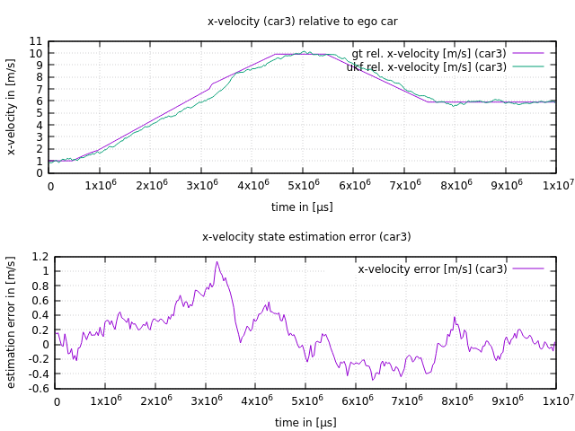

*Fig. 42: X-velocity and x-velocity estimation error over time of target car 3*

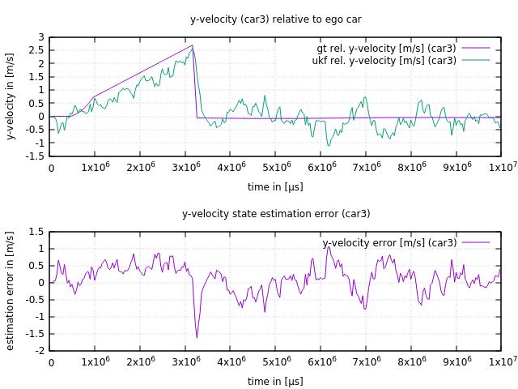

*Fig. 43: Y-velocity and y-velocity estimation error over time of target car 3*

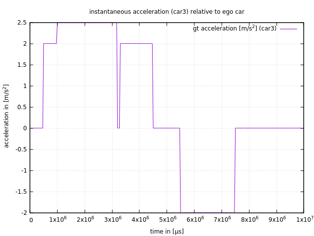

*Fig. 44: Acceleration (ground truth) over time of target car 3*

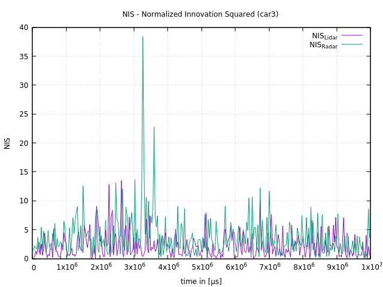

*Fig. 45: NIS (Normalized Innovation Squared) for Lidar and Radar measurement over time for target car 3*
  
